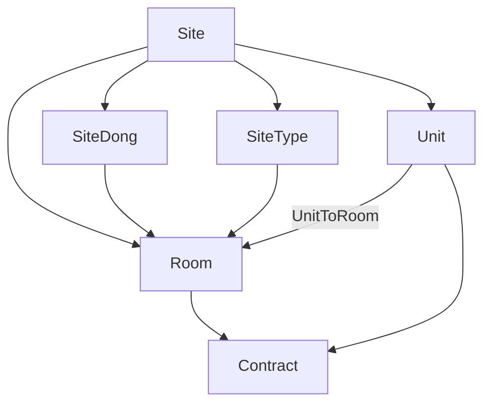

**자산**은 Better Living에서 사이트를 정의하고, 호실 재고를 관리하며, 유닛으로 판매·예약을 노출하는 도메인입니다.  
계약은 자산 스냅샷(`site` · `dong` · `room` · `unit`)을 붙잡고, 인벤토리로 일별 점유를 잠급니다 → [계약](/docs/contract/overview).

## 용어

| 용어 | 의미 |
|------|------|
| **Site** | 사이트 (건물/단지 단위) |
| **SiteDong** | 동 (별도 Building 엔티티 없음) |
| **SiteType** | 평형(면적 타입) |
| **Room** | 호실 — **재고·계약 배정 단위** (`floorNo` + RiseLevel) |
| **Unit** | 유닛 — **마케팅/예약 진입 묶음** (호실 M:N) |
| **UnitToRoom** | 유닛↔호실 연결 |
| **Inventory** | 호실 일별 가용성 · 블록 |

## 계층 (한눈에)

Building / Floor **테이블은 없음**. 층은 `Room.floorNo`, 층 밴드는 `RiseLevel`.



```text
Site
├── SiteType (평형)
├── SiteDong (동)
├── Room (호실)
└── Unit (유닛)
     └── UnitToRoom → Room
```

계약에 저장되는 자산 참조: `siteId` · `siteTypeId?` · `siteDongId` · `roomId` · `unitId`.

## 공개 노출 규칙

| 자산 | 공개에 쓰이는 조건 (요지) |
|------|---------------------------|
| Site | `status=ACTIVE` + `useFl` + `displayFl` |
| Unit | `status=ACTIVE` + `displayFl` (+ 채널용 `externalFl`) |
| Room | `status=ACTIVE` + `displayFl` |

`Status`: `ACTIVE` · `INACTIVE` · `DELETED` (· `CHECK`). Admin이 전시/판매 플래그와 함께 관리합니다.

## 계약과의 연동

| 경로 | 자산 선택 | 인벤토리 |
|------|-----------|----------|
| **Passport** (회원 `WRITE`) | 공개 **유닛** 선택 → 서버가 가용 **호실** 자동 배정 | 가계약금 결제(`BOOKED`) 시 점유 |
| **Admin** 계약 생성 | 사이트 → (평형) → **유닛** → **동** → **호실** | `ADMINSTART` 시 즉시 점유 |
| **Admin 호실 확정** | `BOOKED` + 미확정 호실 | 호실 swap · `roomFixDt` · 이후 `READIED` 경로 |

상세: [인벤토리](/docs/asset/inventory) · [계약](/docs/contract/overview).

## 하위 문서

- [사이트](/docs/asset/site)
- [호실](/docs/asset/room)
- [유닛](/docs/asset/unit)
- [인벤토리](/docs/asset/inventory)
