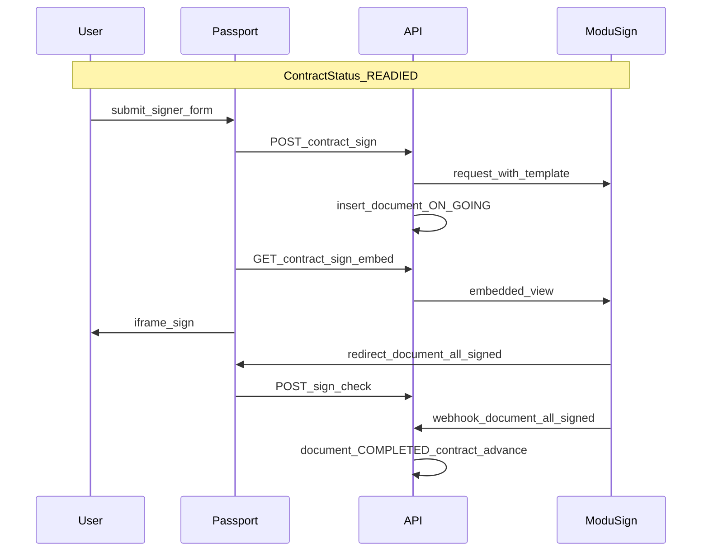

Better Living 전자계약은 **모두싸인(ModuSign)** Document로 서명합니다.  
계약 상태의 **`READIED` → (서명) → `CONTRACTED`(또는 보증금·일자 점프)** 구간입니다. 전체 맥락은 [계약 overview](/docs/contract/overview).

## 전제

| 조건 | 설명 |
|------|------|
| 계약 | 보통 **`READIED`** (Passport는 `BOOKED`에서 SIGN 차단 — “계약서 준비중”) |
| 회원(KO) | 서명 정보 제출 시 **`UserStatus.ACTIVE`** |
| `moduSignFl` | Document 행이 생성됨 |
| `moduSignComplete` | Document `COMPLETED` → SIGN 태스크 완료 |

## Document 상태

| `ContractDocumentStatus` | 의미 |
|--------------------------|------|
| `ON_GOING` | 서명 진행 (초안·진행·처리중 등 원격 상태를 로컬 ON_GOING으로 묶음) |
| `COMPLETED` | 전원 서명 완료 → 계약 상태 전진 |
| `ABORTED` | 취소 (모두싸인 측 상태를 폴링으로 반영) |

행 플래그: `ACTIVE` / `INACTIVE` (Admin disable·abort 후).

## 참여자

| 역할 | 서명 방식 | 비고 |
|------|-----------|------|
| **임차인** | SECURE_LINK → Passport **iframe** | 필수 |
| **중개사** | EMAIL (템플릿에 따라) | REP_AGENT 등 |
| **임대인** | 라이브 서명 없음 | 템플릿 도장 필드 |

타임스탬프(요지): `rent_sign_dt` · `lease_sign_dt`(임차인) · `agent_sign_dt`(중개사).  
Passport 서명 기한 안내 ≈ **7일**(입주일로 캡).

---

## E2E 시퀀스

### Passport 화면

1. `/passport/my-space/[id]/contract` — 서명자 정보 (RSA 전송) → Document 생성  
2. `/passport/my-space/[id]/contract/signature` — 모두싸인 **embedded URL** iframe  
3. 콜백 `eventType=document_all_signed` → `/contract/result`  
4. `POST …/contract/sign/check` — 서버와 상태 동기화  

진입: my-space **SIGN** 태스크 — `moduSignFl`이면 signature로, 없으면 폼부터. → [Passport](/docs/contract/passport)

### 완료 시 계약 전이

Document=`COMPLETED`이고 계약이 `READIED`(등 허용 상태)일 때:

| 조건 | 다음 `ContractStatus` |
|------|------------------------|
| 보증금 미입금 | `CONTRACTED` |
| 보증금 입금 + `startDt` 전 | `GUARANTEED` |
| `startDt` 지남 | `MOVED` |
| `endDt` 지남 | `END` |

동기화 경로(동일 로직에 모임):

- Passport `sign/check`
- 공개 웹훅 `document_all_signed`
- 스케줄러·목록/상세 로드 시 ON_GOING 폴링

---

## Admin

| 동작 | 요지 |
|------|------|
| 문서 강제 완료 | 활성 Document 기준으로 계약 상태 전진 |
| 문서 없이 완료 | 서명 문서 없이 동일 상태 규칙 |
| 기존 Document 연결 | 이미 COMPLETED면 계약도 완료 처리 |
| 로컬 disable | 행 INACTIVE — **모두싸인 abort API를 호출하지 않음** |
| `revoke` → `READIED` | CONTRACTED/GUARANTEED/MOVED에서 서명 전 단계로; 활성 문서 비활성 |

Abort는 원격 Document가 `ABORTED`가 된 것을 폴링으로 반영합니다.

---

## 게이트 · 실패 (요지)

| 상황 | 결과 |
|------|------|
| `BOOKED`에서 SIGN | “계약서 준비중” 토스트 |
| KO · 비 ACTIVE | 본인인증 유도 |
| Document 없이 embed | 문서 없음 오류 |
| 동시 draft 생성 | 진행 중 락 |
| 외국인/사업자 필수 필드 누락 | 서명 생성 거부 |
| result의 eventType 불일치 | 홈 등으로 이탈 |

---

## 체크리스트

- [ ] 서명 UI는 `READIED` 이후에만 (BOOKED는 준비중)
- [ ] Document `ON_GOING` → iframe → `document_all_signed` / check / webhook / poll
- [ ] COMPLETED 시 보증금·일자 분기 반영
- [ ] KO `UserStatus.ACTIVE` 게이트
- [ ] Admin 강제완료·revoke와 Passport 경로를 문서/운영에서 구분

다음: [Passport UX](/docs/contract/passport) · [계약 overview](/docs/contract/overview)
