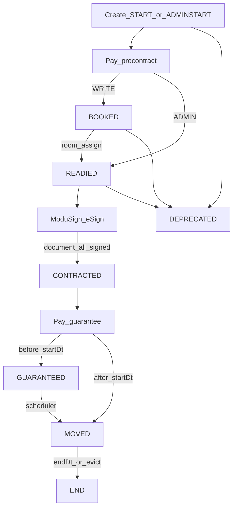

**계약(Contract)은 Better Living의 핵심 도메인**입니다.  
이 페이지에서 **예약 → 모두싸인 서명 → 보증금 → 입주 → 퇴거**까지 한눈에 보고, 상세는 하위 문서로 이어집니다.

- [Passport 유저 UX](/docs/contract/passport) — 상태→화면·CTA·태스크
- [모두싸인 전자계약](/docs/contract/modusign) — Document 서명 E2E

## 용어

| 용어 | 의미 |
|------|------|
| **Better Living** | 서비스 전체 |
| **Passport** | 회원 앱 — 예약·서명·보증금·동거인 |
| **Admin** | 운영 콘솔 — 호실 확정·강제 상태·문서 관리 |
| **모두싸인** | 전자계약 Document 서명 제공 |
| **`ContractStatus`** | 계약 생명주기 |
| **`ContractDocumentStatus`** | 전자계약 문서 상태 (`ON_GOING` / `COMPLETED` / `ABORTED`) |
| **`UserStatus`** | 회원 계정 (계약과 직교) |
| **`ContractUserStatus`** | 계약 멤버십(초대 등) |
| **`ContractRegType`** | `WRITE`(회원) / `ADMIN`(운영) |

## 세 축 + 문서 축

| 축 | 범위 | 하는 일 |
|----|------|---------|
| `UserStatus` | 계정 | FIRST → … → ACTIVE / LOCKED … |
| `ContractStatus` | 계약 1건 | 예약 → **서명** → 보증금 → 거주 → 퇴거 |
| `ContractUserStatus` | 참여 인원 | 초대 REQUEST → ACCEPTED / … |
| Document | 전자계약 1건 | ON_GOING → COMPLETED (또는 ABORTED) |

계정 상태가 계약 전이를 막지 않습니다. 다만 Passport에서 **서명 제출(KO)·결제**만 `UserStatus`/`regPin`으로 막힐 수 있습니다 → [회원](/docs/member/overview).

활성 계약 판별 예: `BOOKED` · `READIED` · `CONTRACTED` · `GUARANTEED` · `MOVED`.

---

## 전체 생명주기 (한눈에)

### WRITE vs ADMIN

| | Passport (`WRITE`) | Admin (`ADMIN`) |
|--|--------------------|-----------------|
| 생성 | → `START` | → `ADMINSTART` |
| 가계약금 후 | → **`BOOKED`** | → **`READIED`** (주로 BOOKED 생략) |
| 호실 확정 | Admin 예약확정 `BOOKED`→`READIED` | 이미 READIED 또는 스케줄러 |
| 서명 | 모두싸인 (Passport) | 동일 문서 + Admin 강제완료 가능 |
| 이후 | 보증금 → 입주 → 퇴거 | 동일 |

`CONTRACTED` **미만**만 일반 취소 → `DEPRECATED`. 서명 완료 후 취소는 불가(일반 경로).

---

## ContractStatus

| Status | step | 요지 |
|--------|------|------|
| `ADMINSTART` | 0 | Admin 초안 · 미결제 |
| `START` | 0 | 회원 초안 |
| `BOOKED` | 1 | 가계약금 결제 · 계약서 준비 전 |
| `READIED` | 2 | **전자계약 서명 가능** |
| `CONTRACTED` | 3 | 서명 완료 · 보증금 전 |
| `GUARANTEED` | 4 | 보증금 입금 · 입주 전 |
| `MOVED` | 5 | 거주중 |
| `END` | 6 | 퇴거 |
| `DEPRECATED` | 99 | 취소 |

---

## 누가 상태를 바꾸는가

| 구간 | 주체 | 요지 |
|------|------|------|
| 생성 · 가계약금 | Passport / Admin / 결제 | START/ADMINSTART → BOOKED 또는 READIED |
| 호실 확정 | Admin | BOOKED → READIED |
| **모두싸인 완료** | Passport + 웹훅 + 폴링 | READIED → CONTRACTED (또는 보증금·일자에 따라 GUARANTEED/MOVED/END) — [상세](/docs/contract/modusign) |
| 보증금 | Admin / 결제 콜백 | → GUARANTEED 또는 MOVED |
| 입주·퇴거 | 스케줄러 / Admin 퇴거 | GUARANTEED→MOVED→END |
| 취소 | Passport·Admin + 환불 | 서명 전 → DEPRECATED |
| 서명 전 롤백 | Admin | CONTRACTED/GUARANTEED/MOVED → READIED |

---

## 모두싸인 구간 (요약)

`READIED`에서 Passport가 서명 정보를내어 Document를 만들고(`ON_GOING`), 모두싸인 iframe에서 임차인(·중개사)이 서명한 뒤 `document_all_signed`로 동기화하면 Document=`COMPLETED`이고 계약은 위 표처럼 전진합니다.

자세한 API·참여자·Admin 강제완료는 **[모두싸인](/docs/contract/modusign)**.

Passport 홈/my-space CTA·태스크는 **[Passport](/docs/contract/passport)**.
