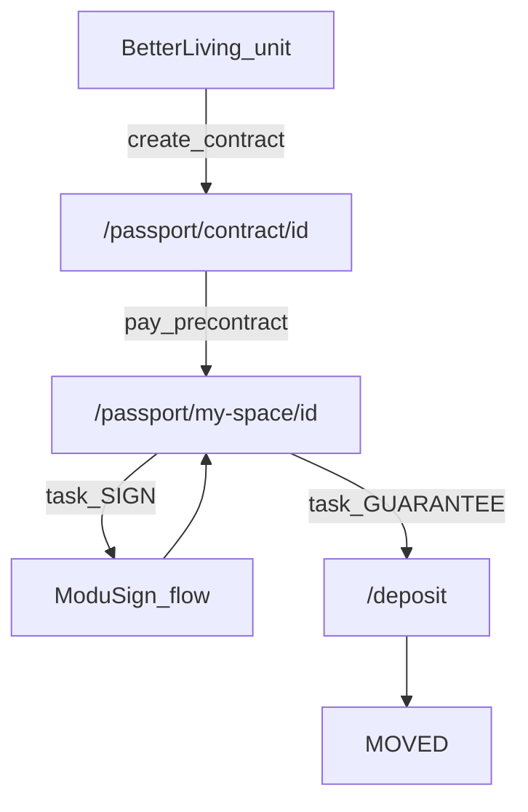

Passport에서 유저가 계약을 다루는 화면·CTA입니다.  
상태 값 집합은 [계약 overview](/docs/contract/overview)의 `ContractStatus`와 동일합니다 (UI 타입명이 BookingStatus여도 값은 같음).

서명 상세는 [모두싸인](/docs/contract/modusign).

## 해피패스

## 홈 진입

| Status | 목적지 |
|--------|--------|
| `ADMINSTART` | `/passport/contract/[id]` — 가계약금 결제 |
| 그 외 | `/passport/my-space/[id]` |

`DEPRECATED`로 my-space 진입 시 back.

## 상태 → 메시지 · 액션

| Status | 유저 메시지 요지 | 주요 액션 |
|--------|------------------|-----------|
| `ADMINSTART` | 결제 후 예약확정 | 가계약금 결제 |
| `BOOKED` | 계약서 준비중 | 대기 (SIGN 탭 → 준비중 토스트) |
| `READIED` | 서명 대기 | [모두싸인](/docs/contract/modusign) 폼 → iframe |
| `CONTRACTED` | 보증금 납입 | `/my-space/[id]/deposit` (계좌 이체 안내) |
| `GUARANTEED` | 입주 전 | 가이드 · 동거인 등 |
| `MOVED` | 이용중 · 월이용료/미납 | 인보이스 결제 · 문열기 · 가이드 |

헤더 칩: `MOVED` → 이용중, 그 전(예약 구간) → 예약완료.  
`CONTRACTED`/`GUARANTEED`/`MOVED`에서 임대 기간·주소·입주 가이드 노출.

## Tasks (`SIGN`, `GUARANTEE`)

my-space 타임라인 (계약자·실거주자; **동거인 역할은 스텝 숨김**).

| Task | 활성 | 클릭 |
|------|------|------|
| `SIGN` | `BOOKED`면 토스트만 | `moduSignFl`이면 signature, 아니면 계약 정보 폼 → [모두싸인](/docs/contract/modusign) |
| `GUARANTEE` | `BOOKED`/`READIED`면 비활성 | 미완료 시 `/deposit`; 완료 시 결제 히스토리 |

가계약금 완료 스텝은 항상 표시(히스토리 링크).

## 가계약금 결제

`/passport/contract/[id]`

- `ADMINSTART`는 “결제 후 호실 배정” 경고가 약함 / 회원 생성 건은 경고 표시
- 주문 → 결제 PIN → 완료
- `UserStatus.LOCKED` → 결제 비밀번호 재설정
- 외국인 `regPin` 없음 → 카드결제 전 비밀번호 등록 유도

## 보증금

앱 내 카드 결제 없음. `/deposit`에서 계좌 안내·복사. 입금 확인은 Admin/서버.

## 동거인

`ContractUserStatus`: `REQUEST` → `ACCEPTED` / 거절·취소·만료.  
초대 UI는 보통 계약이 서명 이후 구간이고 역할 ≠ `ROOMMATES`.

## 회원 게이트 (직교)

| 상황 | 동작 |
|------|------|
| KO 서명 제출 | `UserStatus.ACTIVE` 필요 → 아니면 본인인증 |
| 결제 `LOCKED` | 비밀번호 재설정 경로 |
| 외국인 미등록 PIN | 결제 차단 유도 |

→ [회원 overview](/docs/member/overview)

## 취소

- 당일 결제 취소: 히스토리
- 계약 전체 중도해지 UI 없음 (헬프데스크 카피)
- `DEPRECATED`: 서버·Admin·정책(미서명·미납 등)

다음: [모두싸인](/docs/contract/modusign) · [계약 overview](/docs/contract/overview)
