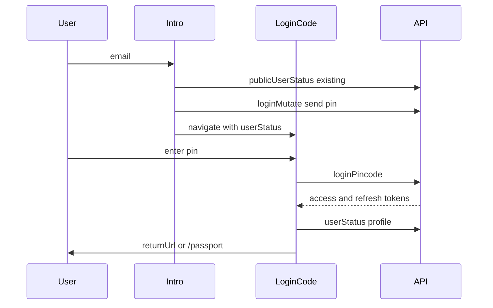

Better Living Passport에서 기존 회원은 `/passport/intro`에서 바로 핀을 발송하고 `/passport/login/code`로 이동합니다.

## 이메일 + 핀

| Step | Screen | Action |
|------|--------|--------|
| 1 | `/passport/intro` | status ∈ `ACTIVE \| READY \| VERIFIED \| LOCKED` → 핀 발송 |
| 2 | `/passport/login/code` | `userStatus` 포함; 핀 입력 → 검증 |
| 3 | Session | (로컬) `bl-atk` / `bl-rtk` 쿠키; 프로필 → auth store |
| 4 | After | 기존 회원이면 Passkey 추천 배너; `returnUrl` 또는 `/passport` |

핀 재전송: 쿨다운/타임아웃 정책은 Passport에서 관리합니다.

## Passkey (보조)

`/passport/intro`에서 WebAuthn:

1. Passkey login start → challenge
2. `navigator.credentials.get`
3. Passkey login finish → tokens
4. 프로필 로드 → `returnUrl` 또는 `/passport`

플랫폼별 `userVerification` 등 OS 제약은 Passport가 처리합니다.

## Sequence (email pin)

## 관련 Passport 화면

- `/passport/intro` — 핀 발송 / Passkey
- `/passport/login/code` — 핀 검증 + 로그인 후 분기
