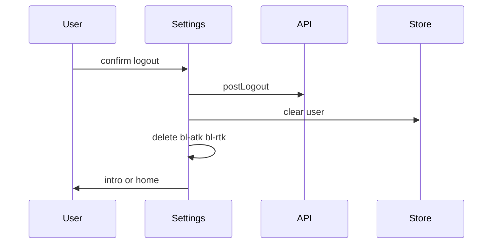

Better Living Passport 로그아웃은 서버 세션 종료와 **로컬 세션 정리**를 함께 수행합니다. API 실패 시에도 로컬 정리는 동일하게 진행합니다.

## 단계

| Step | Action |
|------|--------|
| 1 | 사용자 확인 다이얼로그 (`/passport/settings` / 메뉴) |
| 2 | `postLogout()` |
| 3 | auth store에서 사용자 제거 |
| 4 | `bl-atk`, `bl-rtk` 쿠키 삭제 |
| 5 | Redirect: PWA → `/passport/intro`, 그 외 → `/` |

## Sequence

## Passport 구현 체크리스트

- [ ] 성공/실패 모두 로컬 토큰·유저 클리어
- [ ] PWA와 웹 redirect 분기
- [ ] 메뉴 등 다른 진입점도 동일 logout 계약 사용

## 관련 Passport 화면

- `/passport/settings` — 로그아웃
- Passport 공통 메뉴 — 동일 API·쿠키 정리
