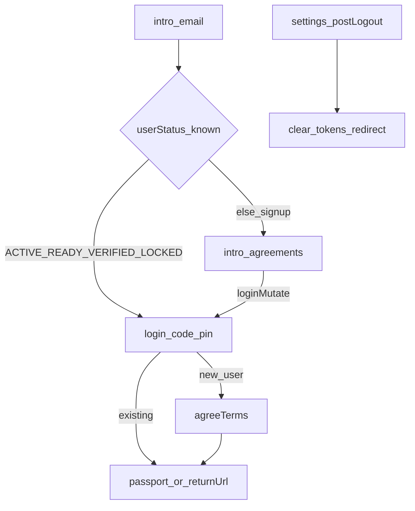

**Better Living** 서비스의 **Passport** 회원 인증은 **이메일 + 핀코드**(선택적으로 **Passkey**) 중심입니다.  
아래는 Passport 공개/비공개 라우트 동작을 구현 계약으로 정리한 것입니다. SDK는 이 플로우를 구현하지 않습니다.

## 용어

| 용어 | 의미 |
|------|------|
| **Better Living** | 제품·서비스 전체 |
| **Passport** | Better Living 회원·인증 영역 (`/passport`) |
| **SDK** | `@dndproperty/betterliving-sdk` — 레이아웃 헬퍼 (인증 UI/API 미포함) |

## 라우트 지도

| Flow | Routes (Passport) | 주요 API / store |
|------|-------------------|------------------|
| Entry | `/passport/intro` | `usePublicUserStatus`, `useLoginMutation`, Passkey |
| Signup | `intro` → `intro/agreements` → `login/code` | terms → pin → `useAgreeTermsMutation` |
| Login | `intro` → `login/code` | status → pin → tokens + profile |
| Logout | `/passport/settings` (및 메뉴) | `postLogout` → clear cookies |

## 세션 쿠키

| Cookie | Role |
|--------|------|
| `bl-atk` | Access token |
| `bl-rtk` | Refresh token |

로컬 개발에서만 클라이언트에 쿠키를 직접 세팅하는 패턴이 있습니다. 프로덕션은 서버/인프라 정책에 따릅니다.

## public / private

- **public:** `intro`, `intro/agreements`, `login/code` — 비로그인 진입
- **private:** settings, home 등 — 토큰·auth store 사용자 필요

## 전체 흐름

## Passport 구현 체크리스트

- [ ] 이메일 입력 후 **user status**로 가입/로그인 분기
- [ ] 기존 회원: 핀 발송 → `/passport/login/code` (+ `userStatus`)
- [ ] 신규: 약관 → 핀 → 약관 동의 API → landing / `returnUrl`
- [ ] 로그아웃: 서버 logout + 로컬 토큰·유저 스토어 정리 + intro 또는 `/`
- [ ] (선택) Passkey 로그인 / 로그인 후 Passkey 추천

다음: [Signup](/docs/flows/signup) · [Login](/docs/flows/login) · [Logout](/docs/flows/logout)
