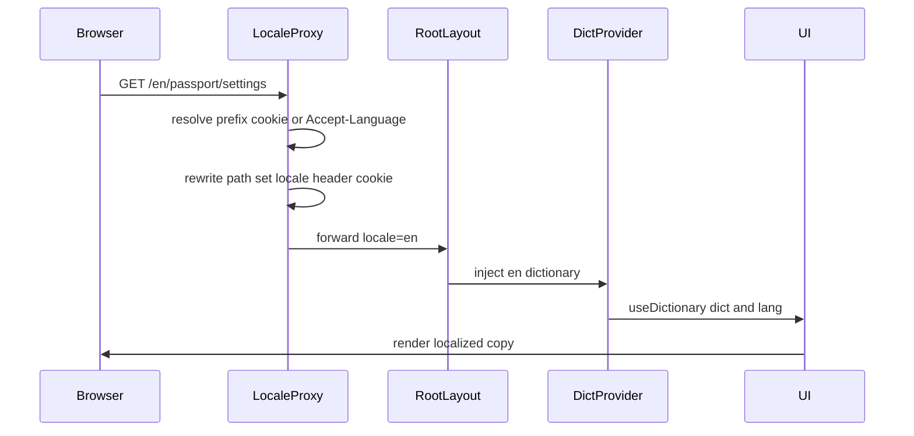

Better Living 서비스는 **하나의 i18n 스택**으로 공개 사이트와 **Passport**를 함께 지원합니다.  
아래는 요청이 들어왔을 때 로케일이 어떻게 정해지고, UI 카피·API 콘텐츠·에러 메시지가 어떻게 그려지는지입니다.

## 용어

| 용어 | 의미 |
|------|------|
| **Better Living** | 서비스 전체 (공개 find/feed + Passport) |
| **Passport** | `/passport` 회원·인증 영역 |
| **Locale** | 런타임 로케일 `ko` \| `en` \| `cn` |
| **Dictionary** | 요청마다 로드되는 UI 카피 번들 |
| **`TLocaleText`** | API 다국어 필드 `{ ko, en, cn }` |

## 한눈에 보기

| 항목 | 동작 |
|------|------|
| 지원 로케일 | `ko`, `en`, `cn` |
| 기본값 | `ko` |
| URL | 유저-facing prefix `/ko`, `/en`, `/cn` (앱 내부 라우트에는 `[locale]` 세그먼트 없음) |
| 전달 | 서버 `locale` 헤더 + `locale` 쿠키 (약 1년) |
| UI 스위치 | **KR / EN**만 노출 (`cn`은 사전·프록시에 존재, 스위치 UI 비노출) |
| UI 소비 | `useDictionary()` → `{ dict, lang }` |
| API 콘텐츠 | `field[lang]` (`TLocaleText`) |
| API 에러 | `message`(주로 ko) + `localization.en` / `localization.cn` |

## 1. 요청 → 로케일 결정

로케일 프록시(엣지)가 **매 요청**에서 locale을 고릅니다. 우선순위:

1. **URL prefix** — `/ko/...`, `/en/...`, `/cn/...`  
   - 내부 경로로 **rewrite** (예: `/en/passport/settings` → `/passport/settings`)  
   - 응답에 `locale` 헤더·쿠키 설정
2. **`locale` cookie** — prefix 없는 URL이면 쿠키 값 사용 + 헤더 설정
3. **`Accept-Language`** 협상 — 둘 다 없으면 브라우저 언어 매칭, 최종 폴백 **`ko`**

앱 라우트 트리는 locale 세그먼트 없이 `/find`, `/passport/...` 형태로 유지되고, **유저에게 보이는 prefix**와 **서버가 읽는 `locale` 헤더**로 언어가 전달됩니다.

## 2. Dictionary 주입 (SSR → CSR)

1. 루트 레이아웃이 `locale` 헤더를 읽어 해당 locale dictionary를 로드합니다.
2. `DictionaryProvider`에 dictionary를 주입합니다.
3. 클라이언트 컴포넌트는 `useDictionary()`로 `{ dict, lang }`를 읽습니다.
4. UI 카피는 `dict.<namespace>.<키>` 형태입니다.  
   - 키는 **한국어 시맨틱 식별자**이며, `ko` / `en` / `cn` 파일에서 **같은 키**를 씁니다.

### `lang` 정규화

- `dict.lang`은 dictionary에 실린 실제 로케일 (`ko` \| `en` \| `cn`).
- 훅이 돌려주는 `lang`은 `cn`이면 **`en`으로 정규화**됩니다.  
  → cn 사용자는 **cn 카피(`dict`)** 를 보지만, API 필드 인덱싱·일부 에러/분기에서는 **en 계열**로 동작할 수 있습니다.  
  → 서버에 진짜 locale을내야 할 때(예: Passport 로그인 `locale`)는 `dict.lang`을 씁니다.

## 3. 언어 전환

Passport 설정·인트로·방문자 플로우의 언어 선택, Better Living 헤더/메뉴의 KR\|EN 스위치가 동일 패턴입니다.

1. 사용자가 `en` (또는 `ko`)을 고름
2. 현재 path에서 locale prefix를 제거한 뒤 `/{locale}{path}` 로 **`location.replace`** (전체 리로드)
3. 프록시가 prefix를 보고 cookie/header를 갱신
4. 루트 레이아웃이 새 dictionary를 로드 → UI 재렌더

내부 링크가 prefix 없이 `/passport`만 가리켜도, 쿠키가 있으면 같은 언어가 유지됩니다. **공유용 URL**은 `/en/...`처럼 prefix를 붙이는 편이 안전합니다.

## 4. API 콘텐츠 · 에러 다국어

### 콘텐츠 (`TLocaleText`)

유닛명, 사이트명, 아티클 제목 등 API가 `{ ko, en, cn }` 객체를 주면 클라이언트는 `field[lang]`로 고릅니다.  
UI dictionary(`dict.*`)와 **별개 레이어**입니다.

### 에러

| 소비자 locale | 표시 문자열 |
|---------------|-------------|
| `ko` | `error.message` |
| `en` (및 정규화된 비-ko) | `error.localization?.en` → 없으면 `message` |
| `cn` (일부 훅) | `error.localization?.cn` → 없으면 en/`message` 폴백 |

에러 헬퍼마다 cn 지원 정도가 다를 수 있으므로, Passport 토스트/폼은 **통일된 헬퍼**를 쓰는 것이 안전합니다.

### lang-driven 비즈니스 규칙 (Passport)

- 로그인 등 API에 `locale: dict.lang` 전달
- 비한국어 사용자 결제 PIN/본인인증 경로 분기 등 — **카피만이 아니라 플로우 자체**가 `lang`에 따라 달라질 수 있음

## 5. Better Living vs Passport

| | Better Living (공개) | Passport |
|--|----------------------|----------|
| i18n 인프라 | 동일 (프록시 · Provider · `useDictionary`) | 동일 |
| Dictionary namespace 예 | `feed`, `find`, `unitDetail`, `news`, `promotion`, `footer` | `intro`, `home`, `payments`, `myspace`, `settings`, `visitor`, … |
| 공유 | `common.*` (버튼, 에러, 통화, 다이얼로그, 메뉴) | 동일 |
| SEO / metadata | 공개 레이아웃에서 locale 반영이 강함 | 일부 레이아웃은 고정(한국어) 메타일 수 있음 |
| 언어 스위치 UI | 헤더·메뉴 (KR/EN) | 설정·인트로·방문자 등 |

## 전체 시퀀스

## 구현 체크리스트

- [ ] 로케일 우선순위: URL prefix → cookie → Accept-Language → `ko`
- [ ] rewrite 후 `locale` 헤더·쿠키 설정, 앱 라우트는 unprefixed
- [ ] 루트에서 dictionary 로드 → `DictionaryProvider` → `useDictionary`
- [ ] UI는 `dict.*`, API 텍스트는 `TLocaleText[lang]` — 혼동하지 않기
- [ ] 언어 스위치는 prefix URL + full navigation
- [ ] API 에러는 `message` / `localization.*` 계약 준수
- [ ] `cn`: 사전·프록시 지원 vs 스위치 UI·`lang` 정규화·메타 한계를 문서/구현에서 인지

SDK(`@dndproperty/betterliving-sdk`)는 i18n API를 제공하지 않습니다. 다국어는 Better Living / Passport 앱 책임입니다.
