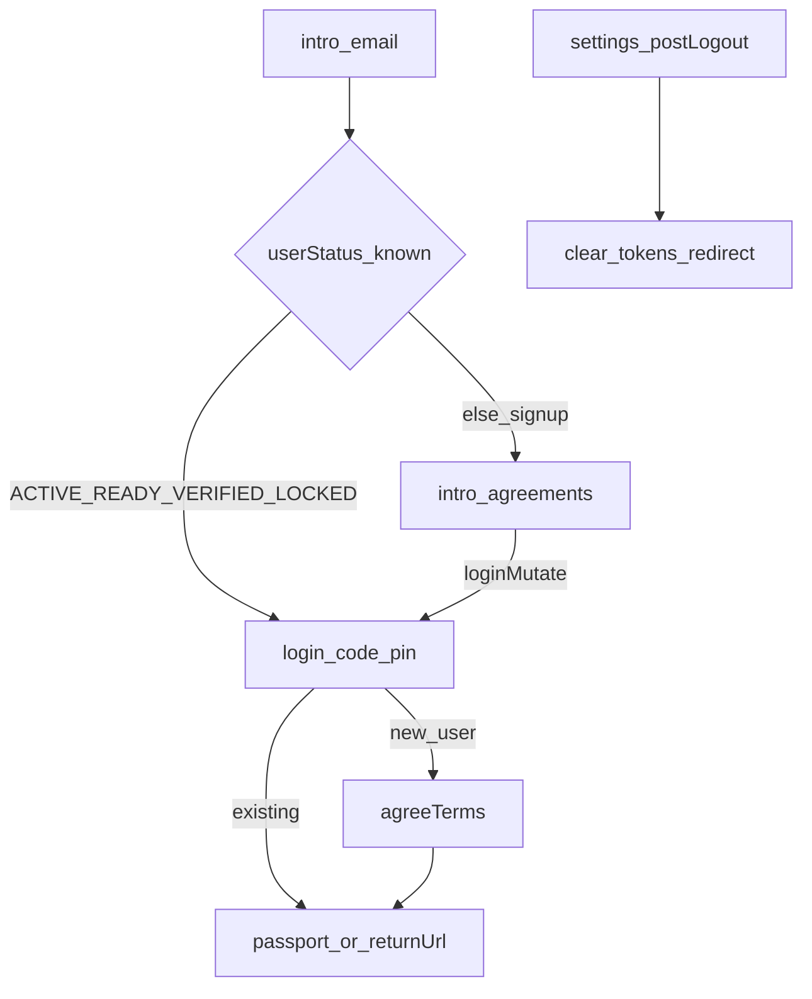

**회원** 도메인은 Better Living Passport의 계정·인증입니다.  
계약 생명주기와는 **직교**합니다 — 자세한 계약 플로우는 [계약](/docs/contract/overview)을 보세요.

## 용어

| 용어 | 의미 |
|------|------|
| **Better Living** | 서비스 전체 |
| **Passport** | 회원·인증 영역 (`/passport`) |
| **Admin** | 운영 콘솔 |
| **`UserStatus`** | 계정 온보딩 상태 |
| **SDK** | `@dndproperty/betterliving-sdk` — 레이아웃만 (인증 UI 미포함) |

## UserStatus

| Status | 요지 |
|--------|------|
| `FIRST` | 최초 |
| `READY` | 약관동의 |
| `VERIFIED` | 인증 |
| `ACTIVE` | 정상 (비밀번호 등) — **전자계약 서명 제출(KO)에 필요** |
| `LOCKED` | 잠김 — 결제 PIN 오류 등, 재설정 플로우 |
| `INACTIVE` / `DELETED` | 비활성·탈퇴 |

로그인 허용 예: `ACTIVE` · `READY` · `VERIFIED` · `LOCKED`.

계약과의 접점만:

- 모두싸인 서명 폼(KO) → `ACTIVE` 아니면 본인인증
- 결제 `LOCKED` / 외국인 `regPin` → [계약 · Passport](/docs/contract/passport)

## 인증 라우트

| Flow | Routes |
|------|--------|
| Entry | `/passport/intro` |
| Signup | `intro` → `intro/agreements` → `login/code` |
| Login | `intro` → `login/code` (+ Passkey) |
| Logout | `/passport/settings` |

세션 쿠키: `bl-atk` / `bl-rtk`.

## 전체 인증 흐름

다음: [Signup](/docs/member/signup) · [Login](/docs/member/login) · [Logout](/docs/member/logout) · [계약](/docs/contract/overview)
