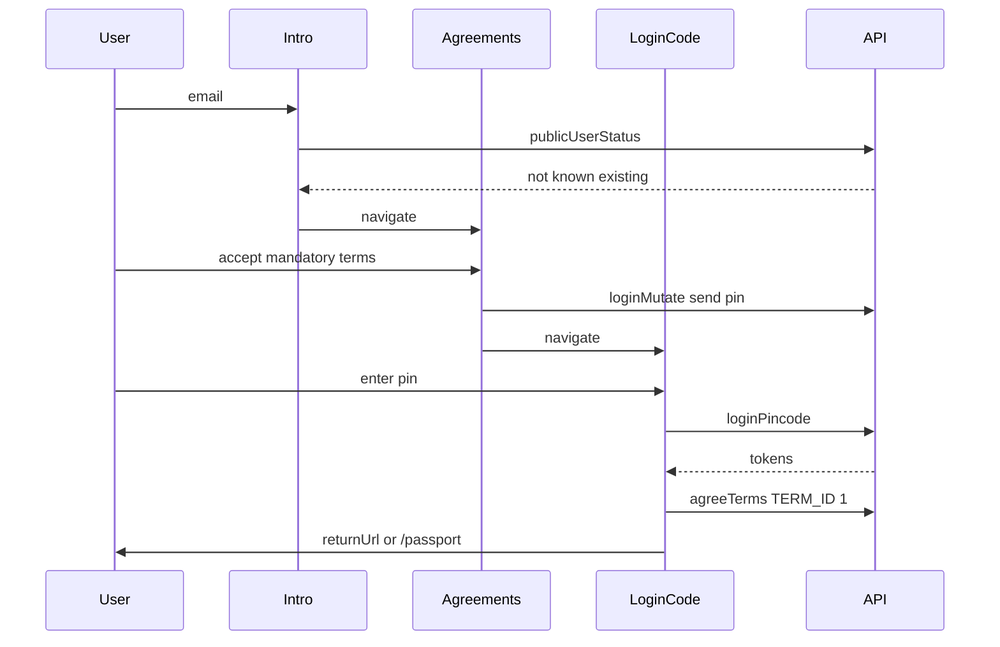

Better Living Passport에서 신규 회원은 **알려진 활성 상태 목록에 없는** 이메일이거나 status 조회 실패 시 가입 경로로 갑니다.

## 분기 (intro)

`/passport/intro`에서 이메일 검증 후 public user status를 조회합니다.

기존 회원으로 보는 status:

- `ACTIVE`
- `READY`
- `VERIFIED`
- `LOCKED`

그 외 → **`/passport/intro/agreements`** (가입).

## 단계

| Step | Screen | Action |
|------|--------|--------|
| 1 | `/passport/intro` | 이메일 입력 → status 조회 → agreements로 이동 |
| 2 | `/passport/intro/agreements` | TERM_ID `1` 필수 약관 체크 → 핀 발송 (`loginMutate`) |
| 3 | `/passport/login/code` | 이메일 핀코드 입력 → 핀 검증 (`loginPincode`) |
| 4 | (API) | 토큰 수신 후 프로필; **신규**면 약관 동의 (`agreeTerms`) |
| 5 | Landing | `returnUrl` 또는 `/passport` |

## Sequence

## 구현 메모

- 약관 화면 진입 시 terms store를 초기화합니다.
- 숨김 term / auto-agreed term은 필수 체크 대상에서 제외할 수 있습니다.
- 핀 성공 후 `userStatus`가 기존 회원 목록에 **없으면** `agreeTerms`를 호출합니다. 있으면 [Login](/docs/member/login)과 같이 Passkey 추천 등으로 분기합니다.

## 관련 Passport 화면

- `/passport/intro` — status 분기
- `/passport/intro/agreements` — 약관 + 핀 발송
- `/passport/login/code` — 핀 검증 + agreeTerms
